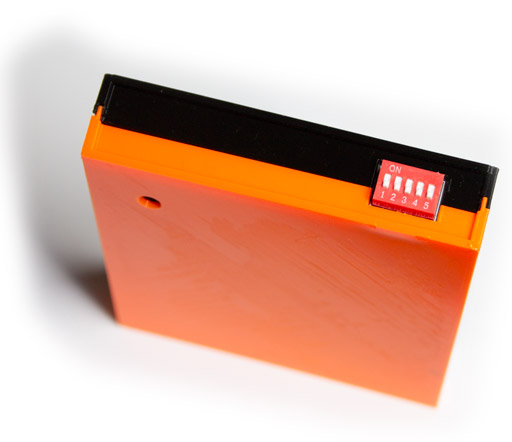
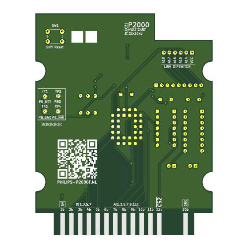
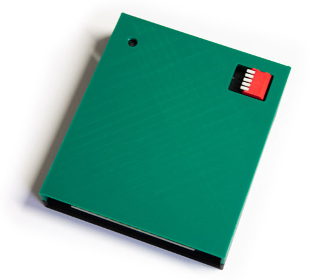
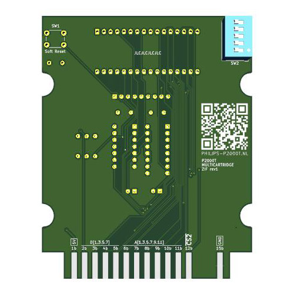

# P2000T Cartridges

## Purpose
Set of homebrew cartridges for the P2000T. More information on these cartridges
can be found [on the website](https://www.philips-p2000t.nl/).

## Overview

### Multirom cartridge

SLOT1 cartridge that allows the user to select one of 32 banks (assuming a 512kb
ROM chip is used). A specific bracket PCB is used to hold the DIP switch which
needs to be wired to the PCB.

Cartridge | PCB
--------- | -
 | 

* [PCB - Multicartridge](multicartridge/pcb/p2000t-multicartridge)
* [PCB - DIP switch plate](multicartridge/pcb/dipswitch-plate)
* [Casing (3d-print files)](multicartridge/case)

### Multirom cartridge - ZIF

SLOT1 cartridge that allows the user to select one of 32 banks (assuming a 512kb
ROM chip is used). Instead of a fixed ROM chip, this cartridge uses a ZIF socket
for easy exchange of the ROM chip.

Cartridge | PCB
--------- | -
 | 

* [PCB](multicartridge-zif/pcb/p2000t-multicartridge-zif)
* [Casing (3d-print files)](multicartridge-zif/case)

### Multirom cartridge kit (smd)

Simplified version of the Multirom cartridge meant for easy soldering.

* [PCB](multicartridge-smd/pcb/p2000t-multicartridge-smd)
* [Casing (3d-print files)](multicartridge-smd/case)