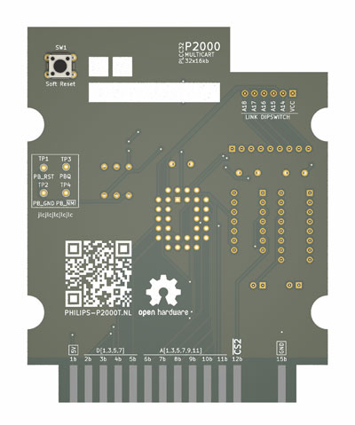
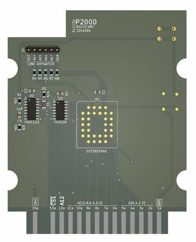
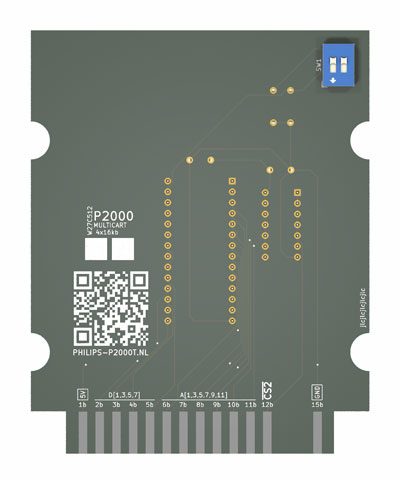
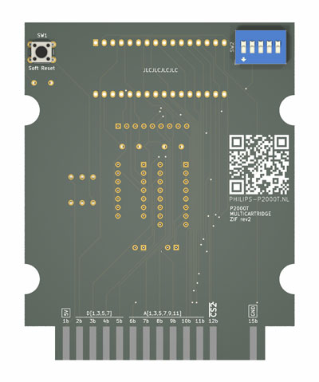
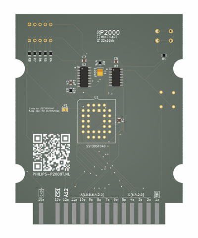

# P2000T Cartridges

## Purpose
Set of homebrew multirom cartridges for the P2000T. These cartridges contain
multiple ROM files stored on a single parallel EEPROM chip. The user can select
the desired program using a DIP switch. More information on these cartridges can
be found [on the website](https://www.philips-p2000t.nl/).

## MultiROM cartridges

> [!TIP]
> * Unsure which cartridge is right for you? The 32x16KiB THT SST39SF040 
>   (512 KiB ROM) offers the most features and is relatively straightforward to 
>   assemble with soldering.
> * When ordering the cartridges, it is advisable to choose an ENIG finish, 
>   opt for gold fingers, and specify a 30-degree chamfer on the edge connector.
> * For flashing the SST39SF0x0 chips, there is [a cheap Flasher tool](https://github.com/ifilot/pico-sst39sf0x0-programmer)
    available, based on the Raspberry Pi PICO.
> * A premade set of cartridge ROM-packs can be found [here](https://github.com/ifilot/p2000t-rompacks).

### 32x16KiB THT SST39SF040 (512 KiB ROM)

A SLOT1 cartridge designed to enable selection from 32 memory banks, assuming
the use of a 512KB ROM chip. It features a dedicated bracket PCB for holding the
DIP switch, which can be connected to the main PCB using either six wires or a
custom flex cable. Additionally, this cartridge includes a soft reset switch,
equipped with a debouncing circuit using a 74HC123 multivibrator. This cartridge
uses **THT** components.

* [PCB - Multicartridge](multicartridge-tht-top-dipswitch/pcb)
* [PCB - DIP switch plate](multicartridge-tht-top-dipswitch/pcb/dipswitch-plate)
* [Flexcable](multicartridge-tht-top-dipswitch/pcb/flexconnector)
* [Casing (3d-print files)](multicartridge/case)

### 32x16KiB SMD SST39SF040 (512 KiB ROM)

Similar to the 32x16KiB THT SST39SF040 cartridge, this version utilizes **SMD**
components, with the exception of the PLCC32 THT socket used for the SST39SF040
chip. Design schematics for the DIP switch plate and the flexcable can be found
under the `THT` variant. Position and BOM files are provided for assembly
service.

* [PCB - Multicartridge](multicartridge-smd-top-dipswitch/pcb)
* [PCB - DIP switch plate](multicartridge-tht-top-dipswitch/pcb/dipswitch-plate)
* [Flexcable](multicartridge-tht-top-dipswitch/pcb/flexconnector)
* [Casing (3d-print files)](multicartridge/case)

### 4 x 16KiB THT W27C512 (64 KiB ROM)

There is also a MultiROM cartridge featuring the reliable W27C512 chip, offering
4x16KB of storage. Unlike the 512KB version, this cartridge omits the soft reset
functionality as a cost-saving measure.

* [PCB - Multicartridge](multicartridge-w27c512/pcb)
* [Casing (3d-print files)](multicartridge-w27c512/case)

### Multirom cartridge - ZIF

SLOT1 cartridge that allows the user to select one of 32 banks (assuming a 512kb
ROM chip is used). Instead of a fixed ROM chip, this cartridge uses a ZIF socket
for easy exchange of the ROM chip. The cartridge also contains a soft reset
switch.

* [PCB](multicartridge-zif/pcb/p2000t-multicartridge-zif)
* [Casing (3d-print files)](multicartridge-zif/case)

### MultiROM cartridge kit (smd)

Simplified version of the SST39SF040 / 512kb cartridge meant for easy soldering.
This cartridge assumes that the SMD components are already placed using an
assembly service of the PCB manufacturer.

* [PCB](multicartridge-smd/pcb)
* [Casing (3d-print files)](multicartridge-smd/case)

## Enclosures

All enclosures have so-called mouse ears which helps in the adhesion
of the enclosure to the print plate. This prevents warping.

Recommended print settings for the enclosures:
* 0.4mm nozzle
* 0.20 - 0.25mm layer height
* 10%-20% infill
